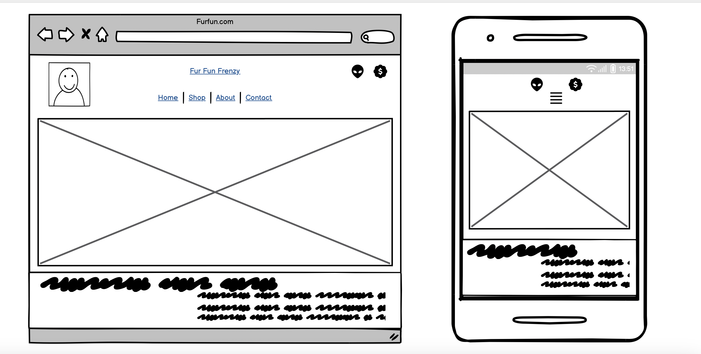

# Fur Fun

# A responsive web application where the users can purchase products for canine companions.

## Code Institute - Milestone Project 4

## HTML/ CSS / JavaScript / Python / Django /  - Full Stack Development Milestone Project 4.

### By Davinder Torna

### Repository Link

[View Repository in GitHub Pages] (https://github.com/Deesingh92/furfun-msp4)

### Live Project Link

[View Deployment link Heroku] (https://furfun-dbbf5a9a33bb.herokuapp.com/)

## Table of Content

- [The Why](#the-why)
- [The Business Goal](#the-business-goal)
- [(UX) User Experience:](#-ux--user-experience-)
  * [User Stories](#user-stories)
    + [First time Users Goals:](#first-time-users-goals-)
    + [Returning Users Goals:](#returning-users-goals-)
    + [Website Owner Goals:](#website-owner-goals-)
    + [As a user in the process of purchasing, I would like to..**](#as-a-user-in-the-process-of-purchasing--i-would-like-to--)
- [**THE 5 PLANES**](#--the-5-planes--)
  * [**Strategy**](#--strategy--)
- [Design:](#design-)
  * [Theme and Colour Scheme](#theme-and-colour-scheme)
    + [Colour By colour:](#colour-by-colour-)
  * [Design Brief:](#design-brief-)
- [Wireframes](#wireframes)
- [Features](#features)
    + [Existing Features:](#existing-features-)
      - [Navigation bar:](#navigation-bar-)
      - [Product Detail:](#Product-detail-)
      - [Shopping cart](#shopping-cart)
      - [Checkout](#checkout)
      - [Registration and Login Form.](#registration-and-login-form)
      - [Footer.](#footer)
- [**DATABASES**](#--databases--)
  * [**Models Flow Chart**](#--models-flow-chart--)
    + [Content Data Base:](#content-data-base-)
    + [Checkout Data Base:](#checkout-data-base-)
    + [Acconts Data Base:](#acconts-data-base-)
- [**TESTING**](#--testing--)
    + [**HTML Testing**](#--html-testing--)
    + [**CSS Testing**](#--css-testing--)
    + [**PEP8 Testing**](#--pep8-testing--)
    + [**User Stories Testing**](#--user-stories-testing--)
    + [**Cross Platfrom Testing**](#--cross-platfrom-testing--)
    + [CRUD (create, read, update, delete) TESTING](#crud--create--read--update--delete--testing)
    + [Form Validation Testing](#form-validation-testing)
  * [Lighthouse testing](#lighthouse-testing)
  * [Responsive Testing](#responsive-testing)
  * [Jest Test Testing Javascript:](#jest-test-testing-javascript-)
      - [I used Jest test to set some of the functions I create with Javascript.](#i-used-jest-test-to-set-some-of-the-functions-i-create-with-javascript)
  * [Django test Testing Python code, views and Models:](#django-test-testing-python-code--views-and-models-)
      - [I used Django tests to set some models and views I cretes  with Python.](#i-used-django-tests-to-set-some-models-and-views-i-cretes--with-python)
  * [Bugs and Fixes](#bugs-and-fixes)
  * [Remainding Errors in the Google Developers Tool Console:](#remainding-errors-in-the-google-developers-tool-console-)
- [**DEPLOYMENT**](#--deployment--)
  * [Making a local clone](#making-a-local-clone)
  * [Working with a local clone](#working-with-a-local-clone)
  * [Deploying to Heroku](#deploying-to-heroku)
  * [Hosting files with AWS](#hosting-files-with-aws)
  * [Setting up a real active email service](#setting-up-a-real-active-email-service)
- [**CREDITS**](#--credits--)
  * [References](#references)
  * [Acknowledgement](#acknowledgement)
- [**DISCLAIMER**](#--disclaimer--)

<small><i><a href='http://ecotrust-canada.github.io/markdown-toc/'>Table of contents generated with markdown-toc</a></i></small>

# content 

- ## The Why

FurFun is a premier E-commerce platform dedicated to catering to all the needs of dog owners, offering a comprehensive range of high-quality products that focus on health, grooming, and entertainment.

- ## The Business Goal

The business goal of FurFun is to become the leading e-commerce platform dedicated to enhancing the lives of dogs and their owners by providing a comprehensive range of high-quality products and services.

- ## (UX) User Experience: 

FurFun aims to provide a seamless and enjoyable shopping experience through a user-friendly website design.

FurFun ensures that customers have all the information they need to make informed purchasing decisions.

To reduce friction and enhance the shopping experience, FurFun offers a streamlined checkout process.

- ### User Stories

  - #### First-time Users Goals:
     - Be able to use the website easily.
     - Be able to browse through all the products available for purchase.
     - Be able to store products in the shopping cart.
     - Be able to proceed with a secure online payment system.
     - Be able to Register on the website.
     - Be able to Read about the company on the website

  - #### Returning Users Goals:
     - To be able to find the list of products saved in their shopping cart.
     - To be able to View and edit my shopping basket.
     - To Have a page with my information given such as username, and email.
     - To be able to purchase with ease and confidence.

  - #### Website Owner Goals:
     - Edit products on the websites for reasons such as typo errors, pricing etc
     - Add and Remove products

 - #### As a user in the process of purchasing, I would like to..** 
     - secured payment system
     - Be acknowledged for how secure the process is for peace of mind.
     - Edit my basket such as deleting an item, changing the quantity etc...
     - Have a confirmation message.

[top](#content)

- ## **THE 5 PLANES** 
- ### **Strategy** 
- Purpose of the website? To be able to purchase products for dogs. 

- Target audience? FurFun's target audience includes a diverse group of individuals and households who share a common love for dogs and are committed to providing the best care for their pets. 

- Value to the user? Have a great selection of dog products to choose from.

- What makes a good experience? 
    * Creating a good user experience is essential for ensuring customer satisfaction, loyalty, and engagement.
    * Clear and straightforward navigation menus. 
    * An easy purchasing process 
    * Consistent branding and colour schemes that create a pleasant atmosphere. 
    * Tailored product suggestions based on browsing history, previous purchases, and user preferences.

- What we shouldn’t do? 
    * To ensure FurFun provides an outstanding user experience, it's crucial to avoid certain pitfalls that can frustrate users and damage the brand’s reputation.
    * Avoid cluttered or overly complicated navigation menus that make it hard for users to find what they are looking for. 

   - ## Design:

   - ### Theme and Colour Scheme

Shades of brown, White  And Grey Color Scheme

A well-thought-out color scheme can enhance the overall user experience and create a cohesive and aesthetically pleasing website. For FurFun, using shades of brown, white, and grey can evoke a sense of warmth, trust, and professionalism. Here’s a detailed breakdown of how to effectively use these colors.

- #### Colour By colour: 

    Brown: Symbolizes reliability, warmth, and a natural feel, which is perfect for a pet-related website.
        Dark Brown (#654321): Use for headers, primary buttons, and key elements to create contrast.
        Medium Brown (#A0522D): Use for secondary buttons, links, and highlights.
        Light Brown (#D2B48C): Use for backgrounds, hover states, and less prominent elements.

    White (#FFFFFF): Represents cleanliness, simplicity, and clarity.
        Background Color: Use as the primary background color to maintain a clean and spacious look.
        Text Color: Use for text on dark brown elements to ensure readability.
        Borders and Dividers: Use for separating sections and creating a clean, organized layout.

    Grey: Conveys neutrality, balance, and sophistication.
        Dark Grey (#333333): Use for body text, icons, and secondary elements.
        Medium Grey (#808080): Use for borders, shadows, and subtle backgrounds.
        Light Grey (#D3D3D3): Use for background shades, form fields, and less prominent sections.

Usage Guide

1. Header and Navigation:

    Background: Dark Brown (#654321)
    Text and Icons: White (#FFFFFF)

2. Main Content Area:

    Background: White (#FFFFFF)
    Primary Text: Dark Grey (#333333)
    Secondary Text: Medium Grey (#808080)

3. Buttons:

    Primary Buttons: Blue (#654321) with White Text (#FFFFFF)
    Secondary Buttons: Grey (#A0522D) with White Text (#FFFFFF)

4. Footer:

    Background: granite (#fff)
    Text and Links: White (#FFFFFF)
    Hover Links: Light Brown (#D2B48C)

5. Forms and Input Fields:

    Background: Light Grey (#D3D3D3)
    Borders: Medium Grey (#808080)
    Text: Dark Grey (#333333)
    Placeholder Text: Medium Grey (#808080)

6. Banners and Highlights:

    Background: Medium Brown (#A0522D)
    Text: White (#FFFFFF)
    Buttons: Dark Brown (#654321) with White Text (#FFFFFF)

Examples of Use

    Homepage Hero Section:
        Background: White (#FFFFFF)
        Hero Image with a warm brown overlay (#D2B48C) to add depth.

    Product Listings:
        Card Background: Light Grey (#D3D3D3)
        Product Name: Dark Grey (#333333)
        Add to Cart Button: Blue (#654321) with White Text (#FFFFFF)

    Information Sections:
        Background: Alternating between Light Brown (#D2B48C) and White (#FFFFFF) for visual variety.
        Headers: Dark Brown (#654321)
        Body Text: Dark Grey (#333333)

By strategically using these shades of brown, white, and grey, FurFun can create a visually appealing and cohesive design that enhances the user experience and aligns with the brand’s warm and trustworthy image.

- ### Design Brief:

+ Colour:

+ Background:

The Background Video was downloaded from [Pexels](https://www.pexels.com/es-es/).

While background videos can sometimes be considered bad practice for UX due to potential distractions and loading times, when implemented thoughtfully, they can enhance the user experience by creating an engaging and dynamic first impression. Since FurFun is a platform dedicated to dog products and you have chosen a video of a dog eating treats, this can effectively showcase the joy and satisfaction that your products bring to pets.

The Video has been selected from a collection of Background videos made to fulfil this purpose.

- ## Wireframes

The Basic structure of Rock Yoga on Demand was created using: 

 [balsamiq](https://balsamiq.com/).

- PC Mac screen: 

 

 

[top](#content)

- ## Features

 - #### Existing Features:
     
   - ##### Navigation bar: 

   - At the top of the FurFun website sits our navigation bar, a reliable companion on your journey to enhancing your dog's life. Crafted with shades of brown, white, and grey, it blends seamlessly with our warm and inviting 	aesthetic while maintaining clarity and professionalism.
      
   

   - ##### Product display list:

   - The users are able to see here all the product that the platform offers. which name and price, the images are links which if the user purchases the product, redirect the users to the product content.

    

   - ##### Product detail:

   - This template provides a clear and structured layout for displaying detailed information about a product. It allows users to quickly view the product image, name, price, description, and rating, and easily add the product to their cart. The use of conditional statements ensures that if certain product information is missing (like an image), the template gracefully handles it by displaying placeholder content.

Overall, this page template offers a user-friendly interface for browsing and purchasing products on FurFun's website.  

   - This page is a product detail view template designed to display information about a specific product on FurFun's e-commerce website.

   - Also the users will be able to add the product to the shopping cart.

     

   - ##### Shopping cart
   
   - The shopping cart functionality allows users to select and store items they intend to purchase from an e-commerce website before proceeding to checkout.

   - Users can browse through FurFun's products and select the items they wish to purchase.

   - Each product detail page includes an "Add to Cart" button.

   - Typically, there's a visual indicator (like a cart icon) showing the number of items in the cart.	

     

   - ##### Checkout 

   - The checkout process is a crucial step in the e-commerce journey where users finalize their purchase by providing necessary information and completing the transaction.

   - FurFun's integration with Stripe allows it to offer a convenient, secure, and reliable payment experience for customers, ensuring that pet owners can easily purchase their favorite products for their furry companions with peace of mind.

       

   - ##### Registration and Login Form.

   - Users can register by providing a username, email, and password.

   - Registered users can log in using their email and password.

   - Upon submission, the data is sent to the server for authentication.

   

   

   - ##### Footer.
   - In the footer section, users will find all the essential contact information and social media links for Fur Fun. The footer also features social media icons for Facebook, Twitter, and Instagram, allowing users to stay connected through various platforms. Additionally, the footer includes a copyright notice, ensuring that all content is protected and reserved for Fur Fun. This layout provides a comprehensive and accessible way for users to contact and connect with the business.

   

- ## Future Features I will like to include.

   - ##### Live Chat Support

   -  Add a live chat feature to the website, offering instant support and assistance to customers with their inquiries and booking needs.

   - ##### Blog and Resources

   - Create a blog section with articles, tips, and resources on pet care, grooming, and training to engage and educate the audience.

   - ##### Virtual Consultations

   - Offer virtual consultations for pet grooming and care advice, making it convenient for customers to get professional guidance from the comfort of their homes.

  - ##### Photo Gallery and Testimonials

   - Include a photo gallery showcasing happy pets and their experiences at Fur Fun, along with customer testimonials to build trust and credibility.

[top](#content)

- ## **DATABASES**

- ### **Models Flow Chart**

- #### Content Data Base:

- #### Checkout Data Base:

- #### Acconts Data Base:

- ## **TESTING**

A separate [TEST.md](TEST.md) file has been created for the documentation of testing.

[Back to top](#table-of-contents)

[top](#content)

## **DEPLOYMENT**
### Making a local clone
You may want to have access via a copy of the repository on your own device. There are three ways to do this: 
* Method 1
1. log in to your GitHub account and open up the repository you would like to copy 
2. Click on the button with a drop-down menu named ‘Code’ which will be placed next to the green ‘Gitpod’ button
3. You will then have the option to download it onto your system via the ‘Download ZIP’ option

* Method 2 
1. Open up your preferred IDE and open up the folder where you would the repository to be copied/cloned
2. In the terminal, type in ‘git clone’; do not press enter or anything else
3. Now login to your GitHub account and open up the repository you would like to copy
4. Click on the ‘Code’ button again and copy the text given under the subheading ‘HTTPS’. A button next to this text gives you an easier way of copying the text
5. Back to your IDE terminal, after the ‘git clone’, press the spacebar button and paste in the link you copied from the repository. Your entry in the terminal should look something like this: ‘git clone https://github.com/shiba517/msp4_gallery_five.git’. Then press enter
6. Your terminal will let you know the repository has been cloned and saved to your preferred destination and will be evident when viewing files and folders from your preferred destination

[top](#content)

### Working with a local clone
1. Install all the requirements from requirements.txt by typing in 'pip3 install -r requirements.txt' into your terminal
2. Create a .gitignore from the root of your project
3. Create an env.py from the root of your project and have it look like this: [image](readme/images/env_py_file.png)
4. Include env.py into .gitignore
5. Create a Stripe account
    * Under the 'Developers' tab, click on 'Webhooks'
    * Click on '+ Add endpoint' and enter the your URL followed by 'checkout/wh/', and check receive all events
6. In your env.py file, fill out the second parameter of every os. environ line with the following:
    * "SECRET_KEY" can be anything you want
    * "STRIPE_PUBLIC_KEY" can be found in your Stripe account under the name of 'Publish key'
    * "STRIPE_SECRET_KEY" can be found in your Stripe account under the name of 'Secret key'
    * "STRIPE_WH_SECRET" can be found in your 'endpoint' tab from your Strip account under the name of 'signing secret'
7. An admin/super_user will need to be created. To do so, type in 'python3 manage.py createsuperuser'; and follow the instructions
8. Now it is time load up your Django with the initial files/data and databases. You can do so by typing into your terminal the following:
    * python3 manage.py makemigrations
    * python3 manage.py migrate
    * python3 manage.py loaddata categories
    python3 manage.py loaddata products
9. You are now done. To get access to your admin, run the server ('python3 manage.py runserver') and type in'/admin' at the end of your URL

[top](#content)

### Deploying to Heroku
1. Install all the requirements from requirements.txt by typing in 'pip3 install -r requirements.txt' into your terminal
2. Create a Heroku account
    * Under 'Add-ons', find Heroku-Postgres and provision  it
3. Follow steps 8 and 7 from the previous subtitle(Working with a local clone)
4. In settings.py, replace and/or add the url of your Heroku app in the variable 'ALLOWED_HOSTS'
5. If you would like quick deployment to Heroku, add your repository to Heroku under Deploy > Connect to Github > Enable automatic deploys

### Hosting files with AWS
1. Create an AWS account
2. Under S3 services, create a new bucket
    * Uncheck 'Block all public access
3. In your newly created bucket, enable Static Web Hosting from the tab Properties
4. Under the 'Permissions' tab, make the following changes:
    * 'Bucket policy' > policy generator
        * Select Type of Policy = select 'S3 Bucket Policy'
        * Principle: type in '*'
        * Actions: select 'GetObject'
        * Amazon Resource Name(ARN): you should find this from the previous window under the 'Bucket policy' tab
        * Add statement > Generaate policy. Copy was given code
        * Paste the code in the editor under the 'Bucket policy tab and add '/*' at the end of the "Resource" image
        * Click save
5. Under IAM services, create a new 'user group'
6. Access management > Policies > Create policy
    * Under the JSON tab, click on 'Import Managed policy' and import 'AmazonS3FullAccess'
    * Now under the JSON tab, include your ARN twice in the 'Resources' with the second followed by '/*'
    * Click on 'Review policy', fill out the name and description, and finally click on 'Create a policy
7. Go to the page of the group you created
    * Under 'Permissions' > Attach Policy, select the policy you have just created and click 'Attach policy'
8. Access management > Users > Add user. Give it a name and check 'Access type'
    * Progress on to the last step without changes and click 'Create user'
    * Download the .csv file and save it somewhere secure as you will NOT be able to download it again once you navigate away from this page
9. In settings.py, change the AWS_STORAGE_BUCKET_NAME to the name of your AWS bucket and AWS_S3_REGION_NAME to your region which you can find in your AWS account
10. In the S3 services, add a new folder named 'media'
    * Upload your images, Select 'Grant public read access to this objects(s)' and finally 'Upload'
11. From your Stripe account, click '+ Add endpoint' and enter in your Heroku URL followed by 'checkout/wh/', and check receive all events
12. Your 'Config Vars' from your Heroku account (under Settings) should look like this: [image](readme/images/heroku_config_look.png)
    * AWS_ACCESS_KEY_ID can be found in your AWS account
    * AWS_SECRET_ACCESS_KEY can be found in your AWS account

[top](#content)

### Setting up a real active email service
1. Create a Gmail account
2. go to Settings > Accounts and Import > Other Google account settings
    * Click on 'Security' tab and enable the 2-step verification
3. Back to 'Security' tab, click on 'App passwords'
    * for 'Select app', select 'Mail'
    * for 'Select device', select 'other'
    * Name your app password and click 'GENERATE'; You will then be given a password
    * Copy and paste the password and add it to your Heroku config variable under the name of 'EMAIL_HOST_PASS'
4. Whilst on the config variable, add another under the name of 'EMAIL_HOST_USER' with its value being your email address

[top](#content)

## **CREDITS**

### References

* REF001 - 'checkout' app was heavily copied, modify and adapted from Code Institute Full Stack Frameworks with Django module (https://learn.codeinstitute.net/courses/course-v1:CodeInstitute+FSF_102+Q1_2020/courseware/4201818c00aa4ba3a0dae243725f6e32/326f171b831446588d33c0333eb4caaa/)
* REF002 - 'Bag' app was heavily copied, modify and adapted from Code Institute Full Stack Frameworks with Django module (https://learn.codeinstitute.net/courses/course-v1:CodeInstitute+FSF_102+Q1_2020/courseware/4201818c00aa4ba3a0dae243725f6e32/5ad560616d634896874fc24f20494e19/)

### Acknowledgement 
* Code Institute course
* Course tutors 
* City of Bristol College
* [W3Schools](https://www.w3schools.com/)

[top](#content)

## **DISCLAIMER**
This website was built for educational reasons for my coding course from Code Institute. No content, written(unless mentioned in CREDITS - Content of this document) and imagery, is of mine. No offence was intentionally made with the pricing of the producta (I randomly made up the numbers, and also randomly collect the videos from YouTube as Content).
If there is anything you would like to enquire about, please do so via my email tornadavinder@gmail.com