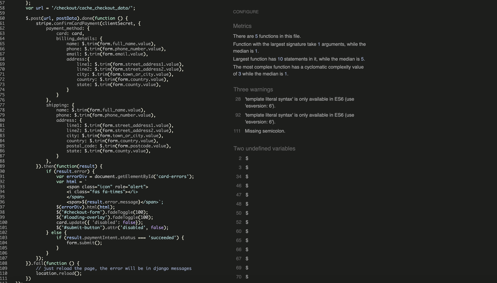

- #### **HTML Testing**
Using - W3C Markup Validator
Errors and Warnings in the .html files have been attended with the help of W3 .html Validator. After alterations, no major errors were found in the .html files; Most were related to the Django templates. The few slightly concerning errors have been documented below
| FILE | Result | Comment
--- | --- | --- |
index.html | [image](static/media/base.html-validator.png) | No Errors
shop.html | [image](static/media/product_list.validator.png) | No Errors
contact.html| [image](static/media/contact-validator.png) | No Errors
product_detail.html | [image](static/media/productvalidator.png) | Only the errors regarding to the Django code left. W3validators does not recognize django syntax as 
base.html | [image](static/media/base.validator.png) | Only the errors regarding to the django code left. W3validators does not recognize django syntax as 
register.html | [image](static/media/register-validator.png) | Only the errors regarding to the django code left. W3validators does not recognize django syntax as 
profile.html | [image](static/media/profile-validator.png) | Only the errors regarding to the django code left. W3validators does not recognize django syntax as 
login.html | [image](static/media/login-validator.png) | Only the errors regarding to the django code left. W3validators does not recognize django syntax as 
cart.html | [image](static/media/cart-validator.png) | Only the errors regarding to the django code left. W3validators does not recognize django syntax as 
checkout_success.html | [image](static/media/success-validator.png) | Only the errors regarding to the django code left. W3validators does not recognize django syntax as 
checkout.html | [image](static/media/checkout-validator.png) | Only the errors regarding to the django code left. W3validators does not recognize django syntax as 

[top](#content)

- #### **CSS Testing**
| FILE | Result | Notes
--- | --- | --- |
checkout.css | [image](static/media/checkout-css.png) | No errors Found
base.css | [image](static/media/checkout-css.png) | No errors Found

[top](#content)

- #### **PEP8 Testing**
* I used pep8online to check whether my .py file codes were PEP8 compliant. I made the changes needed for an All right pass for all .py files.

* I test all the views.py urls.py and models.py from all the apps.

[top](#content)

- #### **User Stories Testing**
| AIM | Achieved | Image |
--- | --- | --- | 
**As a first time visitor to the website, I would like to..** 
Be able to browse through all the product available for purchase | yes | [image1](static/media/product_list.png) |
Be able to select for specific products via categories | yes | [image1](static/images/sorting.png) |
Be able to Know basic information of the Courses easily such as price, name etc | yes | [image1](static/media/product_detail.png) |
Be able to Read about the company of the website | yes | [image](static/media/about.png) |
Be able to communicate with the website as in email, contact number etc | yes | [image1](static/media/contact.png) |
Be able to Register to the website | yes | [image](static/media/register.png) |
Be able to procced with a secure online payment system | yes | [image](static/media/checkout.png) |
**As a registered member to the website, I would like to..** 
To be able to find the list of courses saved in their shopping cart | yes | [image](static/media/cart.png) |
To be able View and edit my shopping basket | yes | [image](static/images/cart.png) |
To have a page with my information given such as name, email, avatar | yes | [image](static/media/footer.png)) | 
**As a site owner/admin user, I would like to..**
Edit products on the websites for reasons such as typo errors, pricing etc | yes | [image](static/images/admin.png) |
Add and remove products | yes | [image delete 1](readme/images/delete_product.png) [image](static/images/admin.png) |
**As a user in the process of purchasing, I would like to..** 
A secured payment system | yes | |
Be acknowledged of how secure the process is for peace of mind | yes | |
Edit my basket such as deleting an item, changing the quantity etc | yes | |
Have a confirmation message | yes | |

[top](#content)

- #### **Cross Platfrom Testing**

- #### CRUD (create, read, update, delete) Testing
| AIM | admin | registered user | non-registered user |
--- | --- | --- | --- |
**Courses/art works - from content app**
CREATE a product to add to the database | yes | no(as intended) | no(as intended)
READ/see a product from the database on the website | yes | yes | yes
UPDATE a product | yes | no(as intended) | no(as intended)
DELETE a product | yes | no(as intended) | no(as intended)
**Bag - from bag app**
CREATE a shopping cart(Add products) | yes | yes | no(as intended)
READ the products in the Shopping cart | yes | yes | no(as intended)
UPDATE the products in the Shopping cart | yes | yes | no(as intended)
DELETE the products in the Shopping cart | yes | yes | no(as intended)
**Profile - from profiles app**
CREATE a Users Profile | yes | yes | no(as intended)
READ  username, email, avatar | yes | yes | no(as intended)
UPDATE username, email, avatar | yes | yes | no(as intended)
DELETE a Users Profile | yes | no | no(as intended)

[top](#content)

- #### Form Validation Testing
| AIM | SM | MD | LG |
--- | --- | --- | --- |
**Register** 
'First Name' field must only contain letters, numbers, and @/./+/-/_ characters | yes | yes | yes
'Last Name' field must only contain letters, numbers, and @/./+/-/_ characters | yes | yes | yes
'E-mail' field must have follow the pattern of have a '@' and a '.' in the email. It won't accept if it does not | yes | yes | yes
'Username' field must only contain letters, numbers, and @/./+/-/_ characters | yes | yes | yes
Both 'Password' fields must match | yes | yes | yes
**Login**
'Login' field must match with user from the database | yes | yes | yes
'Password' field must match with the password made for user entered in the 'Login' field | yes | yes | yes
**Checkout - checkout.html**
'Full Name' field will only accept upto 50 characters | yes | yes | yes
'E-mail' field must have follow the pattern of have a '@' and a '.' in the email | yes | yes | yes
'Phone Number' field will only accept numbers and a maximum of 20 numbers | yes | yes | yes
'Postcode' field will only accept up to 20 characters | yes | yes | yes
'Town or City' field will only accept up to 40 characters | yes | yes | yes
'Street Address 1' field will only accept up to 80 characters | yes | yes | yes
'Street Address 2' field will only accept up to 80 characters | yes | yes | yes
'County, State, or Locality' field will only accept up to 80 characters | yes | yes | yes
'Card number' field will only accept numbers | yes | yes | yes
**Add Products -**
'Category' will have a drop down containing options from the Category database | yes | yes | yes
'Price' will only accept numbers. It will take a numbers up to 4 digits in length | yes | yes | yes
'Price' will not go lower than 0 | yes | yes | yes
'Name' will allow up to 100 characters | yes | yes | yes
'sku' will only allow up to 100 characters | yes | yes | yes
'image' will allow up to 200 characters | yes | yes | yes
'image_url' will be a URL field and it is possible to be empty | yes | yes | yes
'Description' will allow up to 500 characters | yes | yes | yes

**Contact us - _footer.html**
'Name' field will accept upto 100 characters | yes | yes | yes
'E-mail' field must have follow the pattern of have a '@' and a '.' in the email | yes | yes | yes
'Text' will allow up to 500 characters | yes | yes | yes

[top](#content)

- ### Lighthouse testing
I used Google Chrome Lighthouse testing to find out the quality of the website. Here are my results: 
[Desktop](static/media/lighthouse.png)
[Mobile](static/media/lighthouse1.png)

[top](#content)

- ### Responsive Testing
AIM | SM | MD | LG |
--- | --- | --- | --- |
**HOME - home.html**
Links / URLs | yes | yes | yes
Images | yes | yes | yes
Renders as expected | yes | yes | yes
**SHOP - product_list.html**
Links / URLs | yes | yes | yes
Images | yes | yes | yes
Renders as expected | yes | yes | yes
**PRODUCT DETAIL - product_detail.html**
Links / URLs | yes | yes | yes
Images | yes | yes | yes
Renders as expected | yes | yes | yes
Form validation | yes | yes | yes
**CART - CART.html**
Links / URLs | yes | yes | yes
Images | yes | yes | yes
Renders as expected | yes | yes | yes
Form validation | yes | yes | yes
**PROFILE - profile.html**
Links / URLs | yes | yes | yes
Images | yes | yes | yes
Renders as expected | yes | yes | yes
**PROFILE - login.html**
Links / URLs | yes | yes | yes
Renders as expected | yes | yes | yes
**PROFILE - register.html**
Links / URLs | yes | yes | yes
Renders as expected | yes | yes | yes
**CHECKOUT - checkout.html**
Links / URLs | yes | yes | yes
Images | yes | yes | yes
Renders as expected | yes | yes | yes
**CHECKOUT SUCCESS - checkout_success.html**
Links / URLs | yes | yes | yes
Images | yes | yes | yes
Renders as expected | yes | yes | yes

- ### Jest Test Testing Javascript:

- ##### I used JSHINT test to set some of the functions I create with Javascript.

I didnt mannage to test jQuery Code. So create some Mock Function to do the testing

[top](#content)
